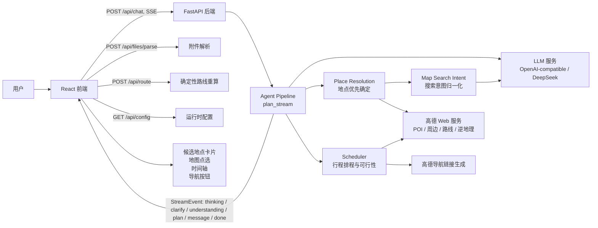
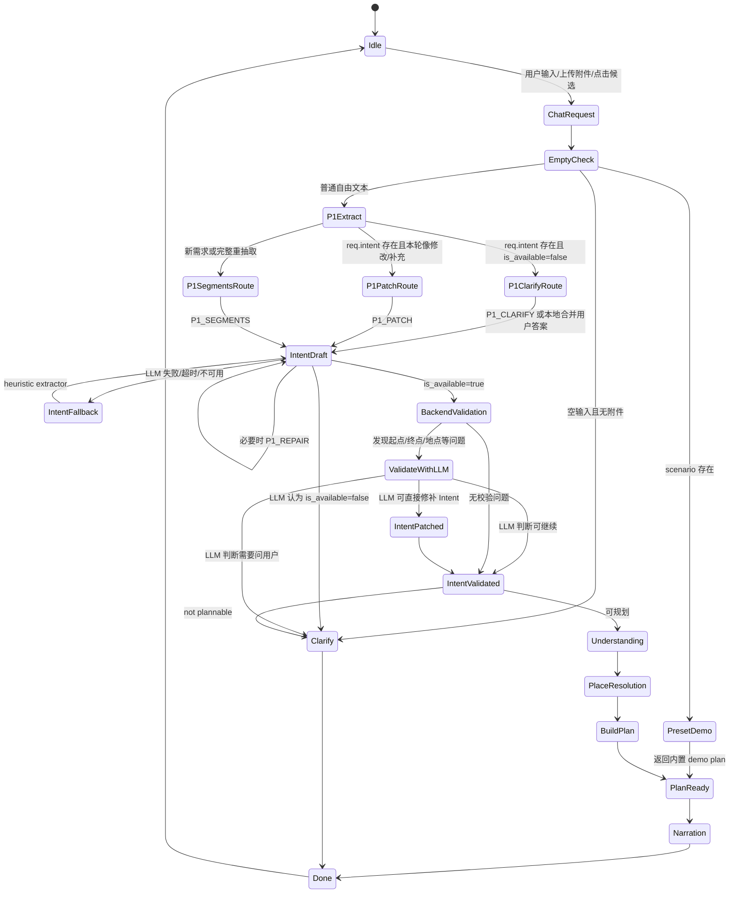
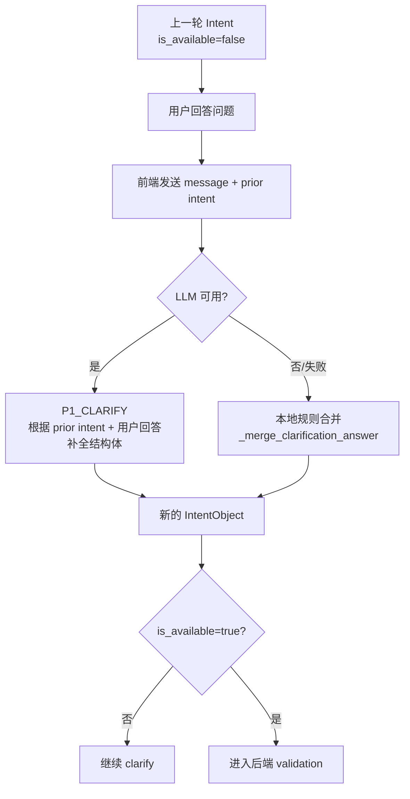
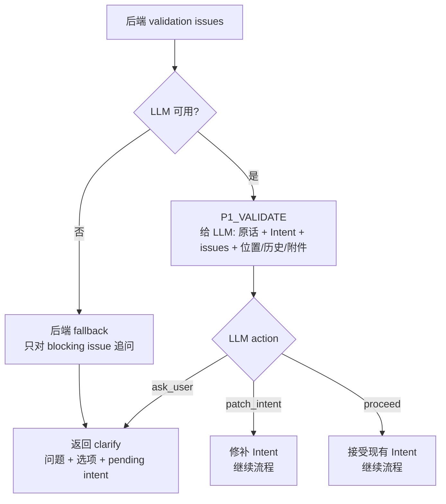
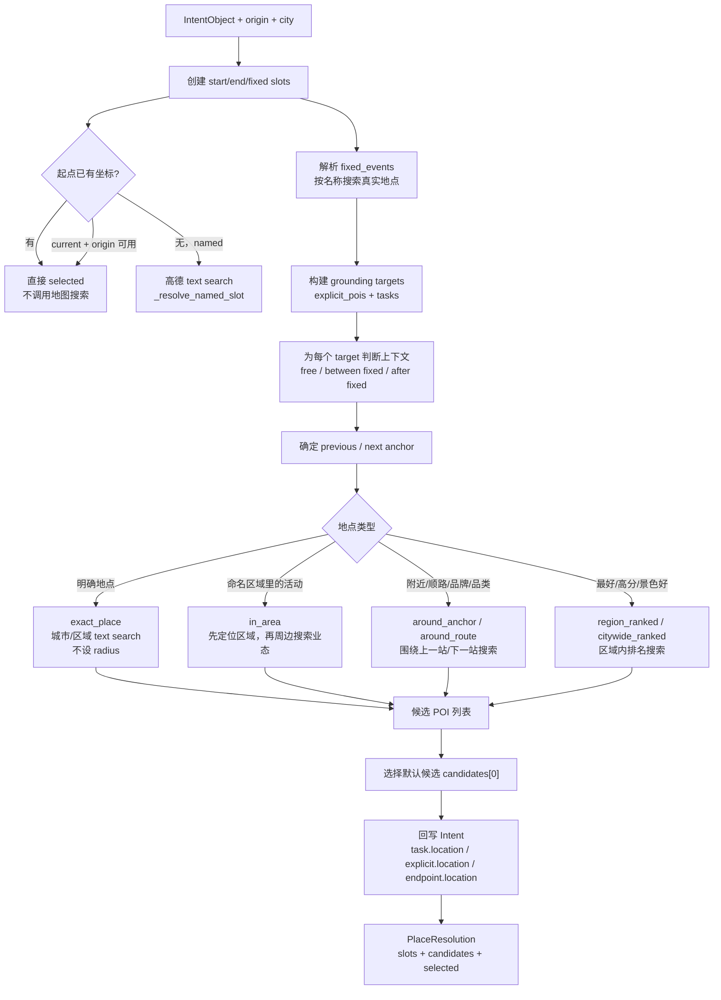
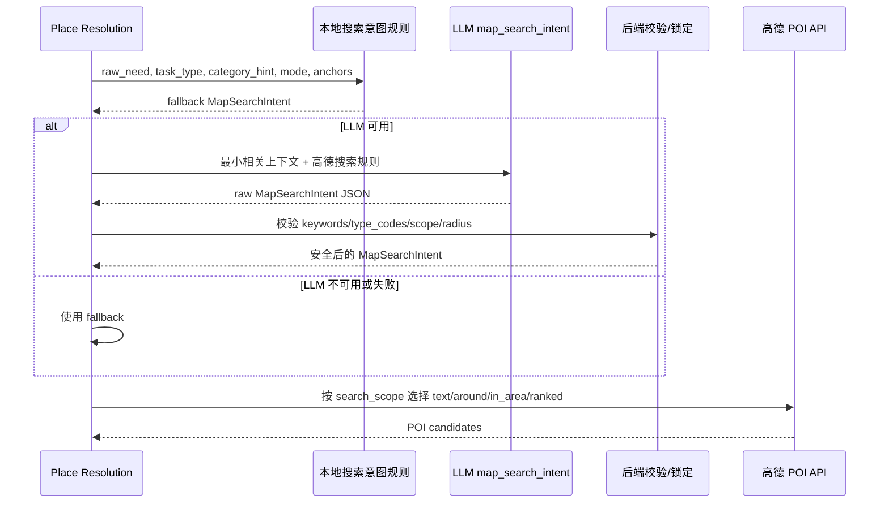
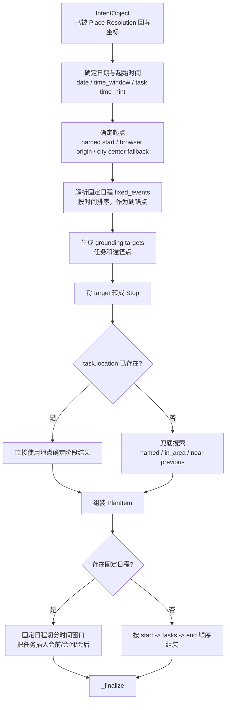
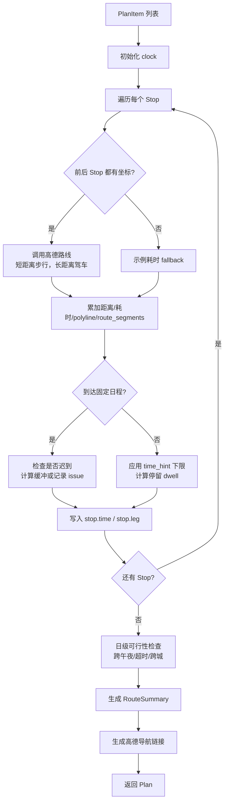
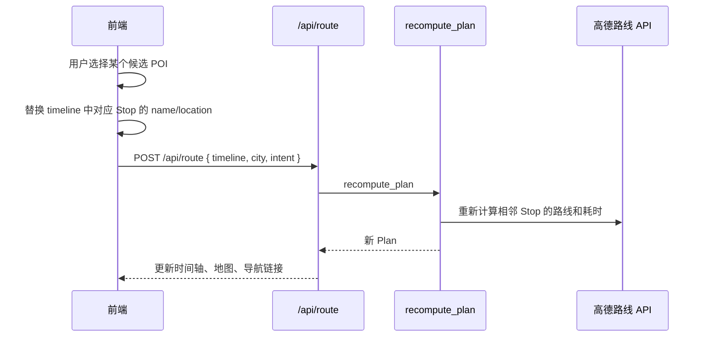
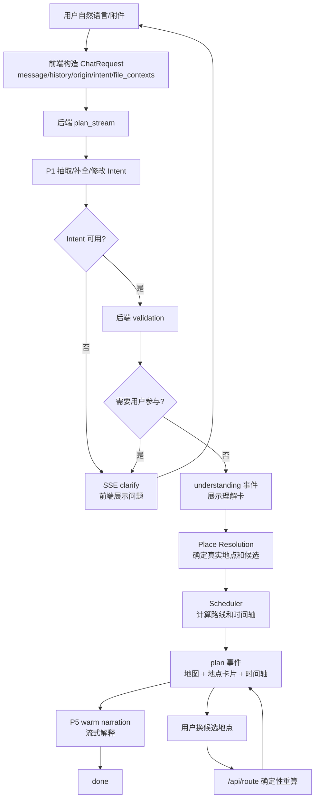

# RoamMind 系统框图与运行逻辑

本文档用于项目报告说明，重点描述 RoamMind 当前实现中的系统结构、路线确定阶段状态机、Place Resolution 阶段后端与 LLM 的协作，以及行程规划阶段的后端逻辑。

## 1. 系统总览

RoamMind 采用“前端交互 + FastAPI 后端编排 + LLM 语义理解 + 高德地图真实 POI/路线服务”的结构。整体设计思想是先把自然语言需求转成结构化 `IntentObject`，再先确定真实地点，最后进行时空移动规划。



核心数据对象：

| 对象 | 所在文件 | 作用 |
|---|---|---|
| `ChatRequest` | `backend/app/models/plan.py` | 前端发给后端的请求，包含当前消息、历史、城市、当前位置、上轮 Intent、附件解析结果 |
| `IntentObject` | `backend/app/models/intent.py` | LLM/规则抽取得到的结构化需求，包含起终点、任务、固定日程、偏好、澄清状态 |
| `PlaceResolution` | `backend/app/models/place.py` | 地点确定阶段产物，包含每个地点 slot 的候选、默认选择、搜索策略 |
| `Plan` | `backend/app/models/plan.py` | 前端最终渲染的计划，包含时间轴、路线摘要、导航链接、可行性说明 |
| `StreamEvent` | `backend/app/models/plan.py` | SSE 流式事件，驱动前端逐步显示理解、追问、计划和解释 |

## 2. 路线确定阶段的状态机

当前代码中没有单独定义一个 `enum State`，而是由以下变量共同形成“隐式状态机”：

- `ChatRequest.intent`：前端携带的上一轮结构化意图。
- `IntentObject.is_available`：结构体是否足够进入后续规划。
- `IntentObject.pending_question_type` / `pending_field`：上一轮追问正在等待哪个字段。
- `IntentObject.clarification_needed`：LLM 或后端希望向用户提出的问题。
- SSE `StreamEvent.type`：前端看到的状态，如 `clarify`、`plan`、`done`。

### 2.1 总体状态转移



### 2.2 关键分支说明

#### A. 新需求抽取

新输入进入 `_extract_intent` 后，如果 LLM 可用，优先使用 `P1_SEGMENTS`。该 prompt 会让 LLM 按原句顺序抽取：

- 起点 `start`
- 终点 `end`
- 行程片段 `segments`
- 固定日程 `fixed_events`
- 情绪/偏好 `mood`、`vibe_tags`、`avoid_tags`
- 是否可进入后续阶段 `is_available`

如果抽取结果有明显语义问题，例如地点字段混入动作、终点误判、返回语义错误，则进入 `P1_REPAIR` 自修复。

#### B. 多轮补全

如果上一轮后端返回了 `clarify`，前端会把未完成的 `IntentObject` 随下一轮用户回答一起发回来。此时 `_is_clarification_turn(req)` 成立，进入 `P1_CLARIFY`：



这样做的目的，是避免把“用户反馈”粗暴拼接到原需求后面，减少模型把同一地点理解成多个地点的风险。

#### C. 多轮修改

如果前端携带了上一轮可用 Intent，且本轮消息像“调整、换、加一个、顺便、刚才、上一轮”等修改语义，则进入 `P1_PATCH`。后端还会执行 `_merge_patch` 保护逻辑：当 patch 结果把原本多个地点意外压缩成一个地点，或完全丢失原地点集合时，会保留上一轮计划，避免“局部修改变成全局重写”。

#### D. 后端校验与 LLM 裁决

后端 validation 先检查当前 Intent 是否有明显阻塞问题，例如：

- 起点为当前位置但浏览器定位不可用。
- 终点是“宿舍/家/酒店”等泛称，且无法由上下文确定。
- 学校、校区、门等地点可能存在多个候选。

如果有问题，当前实现不是直接由后端固定追问，而是优先把问题列表交给 `P1_VALIDATE`，由 LLM 决定：



这对应项目当前的核心原则：后端负责发现结构风险，LLM 负责把风险转译成自然、上下文相关的用户交互。

## 3. Place Resolution 阶段：后端与 LLM 的交互逻辑

Place Resolution 是当前流程里“确定地点”的第一阶段，入口是：

```python
place_resolution = await resolve_place_slots(intent, origin, city)
```

该阶段会生成一组 `PlaceSlot`，每个 slot 对应一个需要落地的地点：

- `start`：起点
- `end`：终点
- `fixed`：固定日程地点
- `waypoint`：明确途径点
- `activity_poi`：由任务/偏好搜索得到的活动地点

每个 slot 包含候选列表 `candidates`、默认选中 `selected`、是否需要用户选择 `needs_user_choice`、搜索范围 `search_scope`、是否周边搜索 `around` 等信息。前端地点卡片和地图点选正是从这里渲染出来的。

### 3.1 Place Resolution 总流程



### 3.2 搜索意图归一化

对于模糊地点、品牌/品类、附近/顺路类需求，后端会调用：

```python
build_map_search_intent(...)
```

它不是直接让 LLM 调地图，而是让 LLM 生成一个受控结构体 `MapSearchIntent`。后端先生成本地 fallback，再在 LLM 可用时请求 LLM 归一化，最后用 `_validate_llm_intent` 做约束校验。



`MapSearchIntent` 的关键字段：

| 字段 | 含义 |
|---|---|
| `search_category` | 餐饮、咖啡茶、安静休息、购物、景点等 |
| `search_scope` | `exact_place`、`around_anchor`、`around_route`、`in_area`、`citywide_ranked`、`region_ranked` |
| `anchor_policy` | 是否依赖上一站、下一站、上一站+下一站、区域中心 |
| `ranking_policy` | 相关性、距离、绕路成本、评分、氛围等排序倾向 |
| `keywords` | 直接传入高德搜索的关键词，禁止包含“买点东西/吃饭/去/顺路”等动作短语 |
| `type_codes` | 高德 POI 类型白名单，如餐饮 `050000`、购物 `060000` |
| `radius_m` / `fallback_radius_m` | 周边搜索半径与扩大半径 |

### 3.3 后端对 LLM 的约束

LLM 在 Place Resolution 阶段只负责“语义归一化”，不能直接决定最终地图结果。后端保留以下控制：

1. `type_codes` 只能来自白名单，避免 LLM 生成高德不支持或不合适的类型码。
2. `keywords` 为空时使用本地 fallback。
3. 对品牌/品类/附近/顺路等本地强规则，后端会锁定为 around 搜索，不允许 LLM 改成全城 ranked。
4. 对明确地点 `exact_place`，后端不使用周边搜索，不设置 radius，而是在城市/区域内做文本搜索。
5. 地图 API 结果必须是真实 POI；没有结果时会生成占位并在可行性中提示，而不是让 LLM 幻觉地点。

## 4. 行程规划阶段：后端排程与路线逻辑

Place Resolution 完成后，`IntentObject` 已经尽可能带有真实坐标。接下来进入：

```python
plan = await build_plan(intent, origin, city)
plan.place_resolution = place_resolution
```

行程规划阶段的职责不是重新理解用户意图，而是把已经确定的地点变成时间轴和路线。

### 4.1 `build_plan` 主流程



### 4.2 固定日程处理

固定日程是硬约束。调度器会：

1. 按 `fixed_event.start` 排序。
2. 将固定日程地点转成 `Stop(kind="fixed")`。
3. 对两个固定日程之间的任务，调用 `_task_likely_between_fixed` 判断是否应插入会间。
4. 对第一个固定日程，如果用户给了明确起点，会反推起点出发时间，预留 `FIRST_FIXED_BUFFER_MIN` 缓冲。
5. 如果预计到达固定日程时已经迟到，会把问题写入 `feasibility.note`。

### 4.3 `_finalize` 路线与时间级联

`_finalize` 是初次规划和换地点重算共用的确定性函数。



可行性检查包括：

- 是否跨越午夜。
- 是否超过用户希望的结束时间。
- 是否出现单段超过约 120km 的路线，提示疑似跨城市。
- 是否存在未找到真实地点的占位。
- 是否赶不上固定日程。

当前实现不会真正验证营业时间，因此可行性文案不会声称“已核对营业时间”。

### 4.4 换地点后的重算

前端地点卡片或时间轴中切换候选后，不会重新进入 LLM，也不会重新做 Place Resolution。流程是：



这保证了“换一个地点”是快速、可解释、确定性的：只改变用户选中的 POI 及其连带路线耗时，不让模型重新解释整段需求。

## 5. 端到端运行逻辑摘要



一句话概括当前系统逻辑：RoamMind 不是让 LLM 一步生成完整路线，而是让 LLM 负责语义理解和必要澄清，让后端控制地点落地、地图检索、路线计算、时间排程和可行性判断，从而在自然交互与真实可执行之间取得平衡。

## 6. 可在报告中强调的设计特点

1. **结构化中间层**：自然语言不会直接变成路线，而是先变成 `IntentObject`，便于校验、补全和多轮修改。
2. **地点优先**：先通过 Place Resolution 把起点、终点、固定日程和活动地点落到真实 POI，再做路线规划。
3. **LLM 受控参与**：LLM 负责理解、澄清和搜索意图归一化；地图调用、候选选择、半径策略、可行性判断由后端掌控。
4. **候选可交互**：每个地点 slot 都可以保留多个候选，前端允许用户点选候选并触发确定性重算。
5. **渐进降级**：LLM 不可用时走 heuristic；高德不可用时使用示例/占位；流式接口不会因为单个外部服务失败而挂死。
6. **多轮状态保持**：前端把上一轮 `IntentObject` 发回后端，使澄清回答和局部修改可以在结构体层面继续，而不是简单拼接文本。
